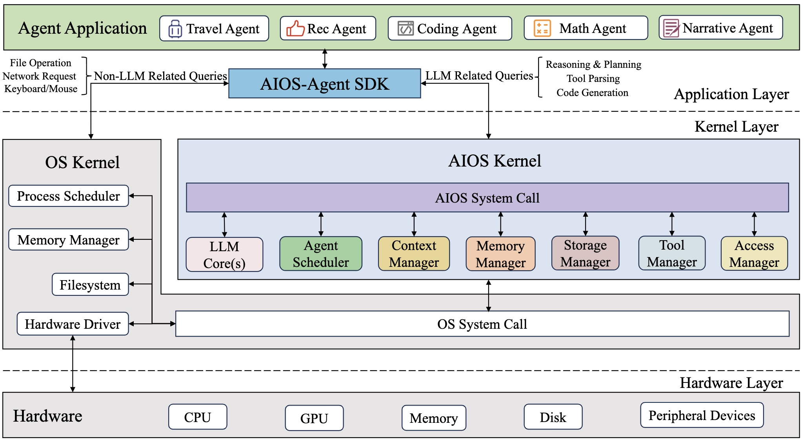
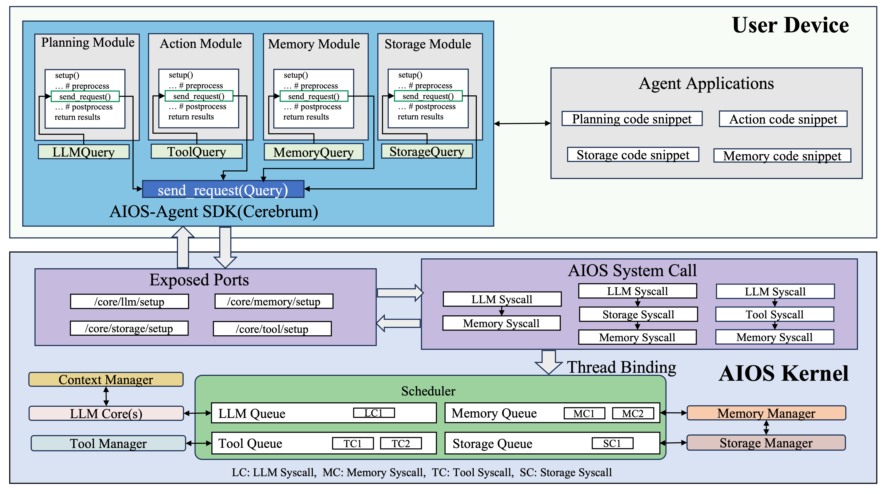
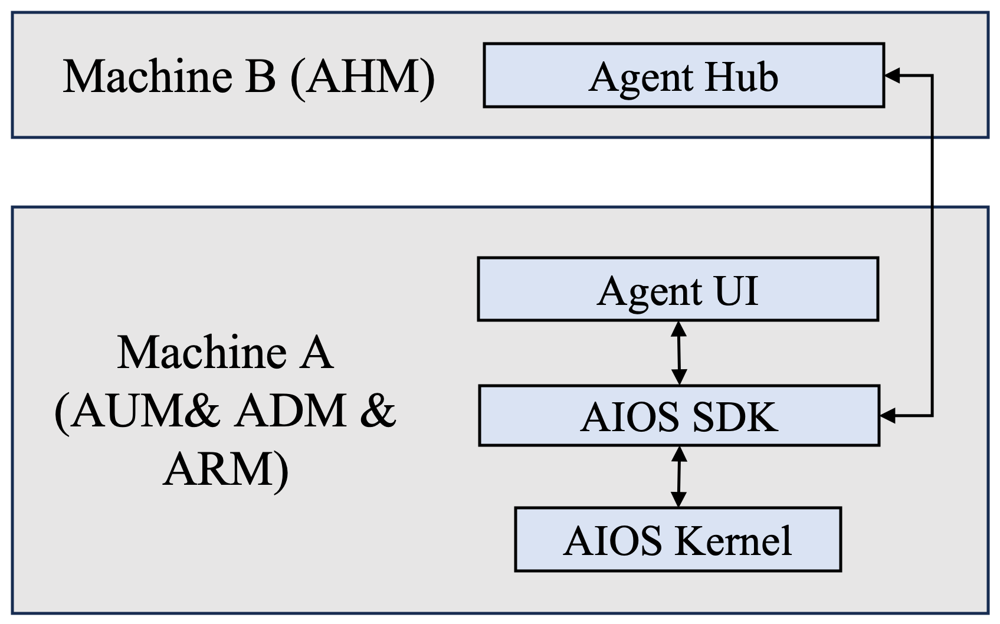
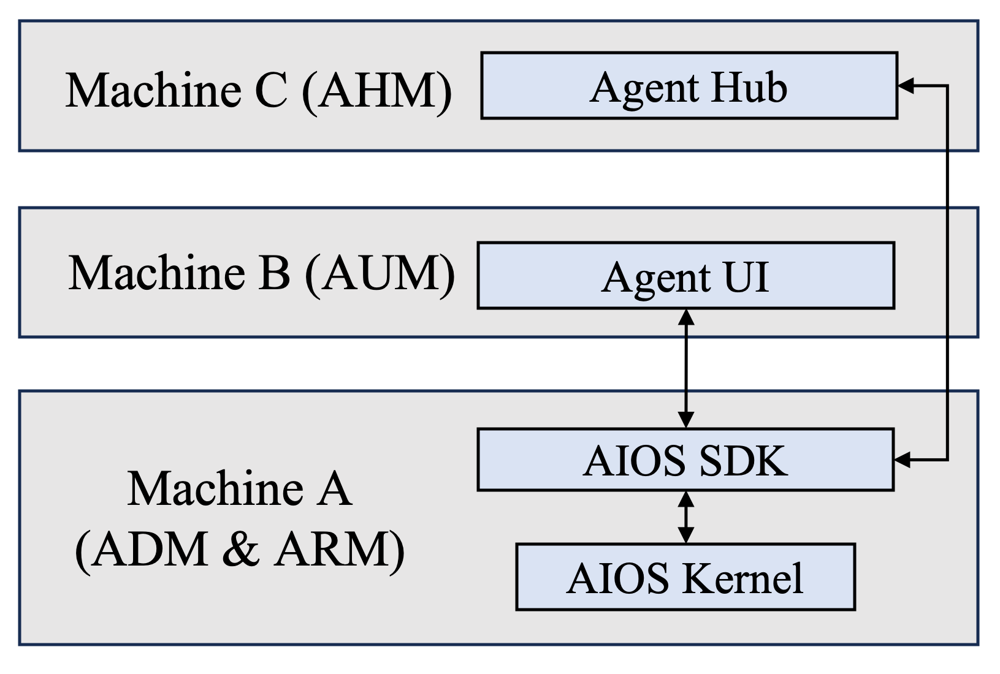
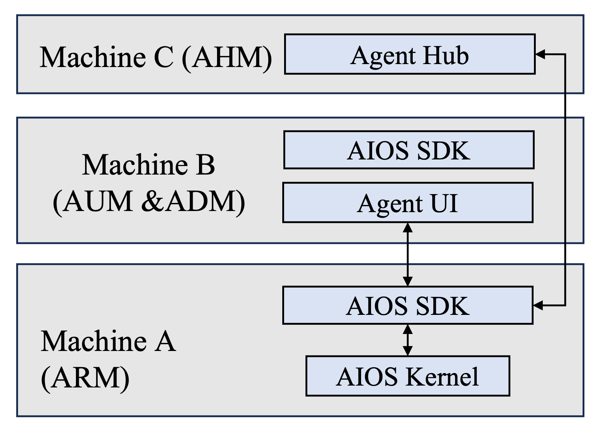
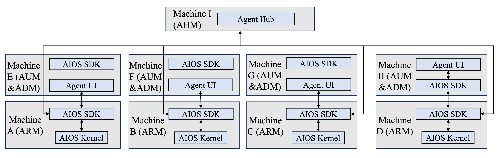

# AIOS: AI Agent Operating System

<a href='https://arxiv.org/abs/2403.16971'></a>
<a href='https://arxiv.org/abs/2312.03815'></a>
<a href='https://docs.aios.foundation/'></a>
[](https://github.com/agiresearch/AIOS/blob/main/LICENSE)
<a href='https://discord.gg/B2HFxEgTJX'></a>
[](https://gurubase.io/g/aios)

<a href="https://trendshift.io/repositories/8908" target="_blank"></a>

AIOS is the AI Agent Operating System, which embeds large language model (LLM) into the operating system and facilitates the development and deployment of LLM-based AI Agents. AIOS is designed to address problems (e.g., scheduling, context switch, memory management, storage management, tool management, Agent SDK management, etc.) during the development and deployment of LLM-based agents, towards a better AIOS-Agent ecosystem for agent developers and agent users. AIOS includes the AIOS Kernel (this [AIOS](https://github.com/agiresearch/AIOS) repository) and the AIOS SDK (the [Cerebrum](https://github.com/agiresearch/Cerebrum) repository). AIOS supports both Web UI and Terminal UI.

## 🏠 Architecture of AIOS
### Overview
<p align="center">

</p>

The AIOS system is comprised of two key components: the AIOS kernel and the AIOS SDK.
The AIOS kernel acts as an abstraction layer over the operating system kernel, managing various resources that agents require, such as LLM, memory, storage and tool. 
The AIOS SDK is designed for agent users and developers, enabling them to build and run agent applications by interacting with the AIOS kernel.
AIOS kernel is the current repository and AIOS SDK can be found at [here](https://github.com/agiresearch/Cerebrum)

### Modules and Connections
Below shows how agents utilize AIOS SDK to interact with AIOS kernel and how AIOS kernel receives agent queries and leverage the chain of syscalls that are scheduled and dispatched to run in different modules. 
<p align="center">

</p>

## 📰 News
- **[2025-01-27]** 🔥 Deepseek-r1 (1.5b, 7b, 8b, 14b, 32b, 70b, 671b) has already been supported in AIOS, both open-sourced versions and deepseek apis (deepseek-chat and deepseek-reasoner) are available. 
- **[2024-11-30]** 🔥 AIOS v0.2: Disentangled AIOS Kernel (this [AIOS](https://github.com/agiresearch/AIOS) repository) and AIOS SDK (The [Cerebrum](https://github.com/agiresearch/Cerebrum) repository), Remote Kernel for agent users. 
- **[2024-09-01]** 🔥 AIOS supports multiple agent creation frameworks (e.g., ReAct, Reflexion, OpenAGI, AutoGen, Open Interpreter, MetaGPT). Agents created by these frameworks can onboard AIOS. Onboarding guidelines can be found at the [Doc](https://docs.aios.foundation/aios-docs/aios-agent/how-to-develop-agents).
- **[2024-07-10]** 📖 AIOS documentation is up, which can be found at [Website](https://docs.aios.foundation/).
- **[2024-06-20]** 🔥 Function calling for open-sourced LLMs (native huggingface, vLLM, ollama) is supported.
- **[2024-05-20]** 🚀 More agents with ChatGPT-based tool calling are added (i.e., MathAgent, RecAgent, TravelAgent, AcademicAgent and CreationAgent), their profiles and workflows can be found in [OpenAGI](https://github.com/agiresearch/OpenAGI).
- **[2024-05-13]** 🛠️ Local models (diffusion models) as tools from HuggingFace are integrated.
- **[2024-05-01]** 🛠️ The agent creation in AIOS is refactored, which can be found in our [OpenAGI](https://github.com/agiresearch/OpenAGI) package.
- **[2024-04-05]** 🛠️ AIOS currently supports external tool callings (google search, wolframalpha, rapid API, etc).
- **[2024-04-02]** 🤝 AIOS [Discord Community](https://discord.gg/B2HFxEgTJX) is up. Welcome to join the community for discussions, brainstorming, development, or just random chats! For how to contribute to AIOS, please see [CONTRIBUTE](https://github.com/agiresearch/AIOS/blob/main/docs/CONTRIBUTE.md).
- **[2024-03-25]** ✈️ Our paper [AIOS: LLM Agent Operating System](https://arxiv.org/abs/2403.16971) is released!
- **[2023-12-06]** 📋 After several months of working, our perspective paper [LLM as OS, Agents as Apps: Envisioning AIOS, Agents and the AIOS-Agent Ecosystem](https://arxiv.org/abs/2312.03815) is officially released.

## Different deployment modes of AIOS
Here are some key notations that are required to know before introducing the different modes of AIOS. 
- **AHM (Agent Hub Machine)**: Central server that hosts the agent marketplace/repository where users can publish, download, and share agents. Acts as the distribution center for all agent-related resources.
- **AUM (Agent UI Machine)**: Client machine that provides user interface for interacting with agents. Can be any device from mobile phones to desktops that supports agent visualization and control.
- **ADM (Agent Development Machine)**: Development environment where agent developers write, debug and test their agents. Requires proper development tools and libraries.
- **ARM (Agent Running Machine)**: Execution environment where agents actually run and perform tasks. Needs adequate computational resources for agent operations.

The following parts introduce different modes of deploying AIOS. **Currently, AIOS already supports Mode 1 and Mode 2, other modes with new features are still ongoing.**

### Mode 1 (Local Kernel Mode)

<p align="center">

</p>

- Features:
  - For agent users: They can download agents from agent hub from Machine B and run agents on Machine A. 
  - For agent developers: They can develop and test agents in Machine A and can upload agents to agent hub on Machine B.

### Mode 2 (Remote Kernel Mode)

<p align="center">

</p>

- Features: 
  - Remote use of agents: Agent users / developers can use agents on Machine B, which is different from the development and running machine (Machine A).  
  - Benefit users who would like to use agents on resource-restricted machine (e.g., mobile device or edge device)

### Mode 2.5 (Remote Kernel Dev Mode)

<p align="center">

</p>

- Features:
  - Remote development of agents: Agent developers can develop their agents on Machine B while running and testing their agents in Machine A. Benefit developers who would like to develop agents on resource-restricted machine (e.g., mobile device or edge device)
- Critical technique:
  - Packaging and agent transmission on different machines for distributed agent development and testing

### Mode 3 (Personal Remote Kernel Mode)

<p align="center">

</p>

- Ongoing Features:
  - Each user/developer can have their personal AIOS with long-term persistent data as long as they have registered account in the AIOS ecosystem
  - Their personal data can be synced to different machines with the same account

- Critical techniques:
  - User account registration and verification mechanism
  - Persistent personal data storage for each user's AIOS
  - Synchronization for different AIOS instances on different devices within the same account
  - Data privacy mechanism

### Mode 4 (Personal Remote Virtual Kernel Mode)

<p align="center">

</p>

- Ongoing Features:
  - Different user/developer’s personal AIOS kernels can co-exist in the same physical machine through virtualization
- Critical techniques:
  - Virtualization of different AIOS kernel instances in the same machine
  - Scheduling and resource allocation mechanism for different virtual machines located in the same machine


## ✈️ Getting Started
Please see our ongoing [documentation](https://docs.aios.foundation/) for more information.
- [Installation](https://docs.aios.foundation/aios-docs/getting-started/installation)
- [Quickstart](https://docs.aios.foundation/aios-docs/getting-started/quickstart)
- [WebUI Quickstart](https://docs.aios.foundation/aios-docs/getting-started/webui-quickstart)

### Installation
#### Requirements
##### Python
- Supported versions: **Python 3.10 - 3.11**

#### Set Up API Keys
You need API keys for services like OpenAI, Anthropic, Groq and HuggingFace. The simplest way to configure them is to edit the aios/config/config.yaml.

> [!TIP]
> It is important to mention that, we stronglyrecommend using the `aios/config/config.yaml` file to set up your API keys. This method is straightforward and helps avoid potential sychronization issues with environment variables. 

A simple example to set up your API keys in `aios/config/config.yaml` is shown below:
```yaml
deepseek: "your-deepseek-key"
openai: "your-openai-key"
gemini: "your-gemini-key"
groq: "your-groq-key"
anthropic: "your-anthropic-key"
huggingface:
  auth_token: "your-huggingface-token"
  home: "optional-path"
```

To obtain these API keys:
1. Deepseek API: Visit https://api-docs.deepseek.com/
2. OpenAI API: Visit https://platform.openai.com/api-keys
3. Google Gemini API: Visit https://makersuite.google.com/app/apikey
4. Groq API: Visit https://console.groq.com/keys
5. HuggingFace Token: Visit https://huggingface.co/settings/tokens
6. Anthropic API: Visit https://console.anthropic.com/keys

**Use ollama Models:** If you would like to use ollama, you need to download ollama from from https://ollama.com/.
Then pull the available models you would like to use from https://ollama.com/library
```bash
ollama pull llama3:8b # use llama3:8b for example
```
Then you need to start the ollama server either from ollama app
or using the following command in the terminal
```bash
ollama serve
```
> [!TIP]
> ollama can support both CPU-only and GPU environment, details of how to use ollama can be found at [here](https://github.com/ollama/ollama)


**Use Huggingface Models:** Some of the huggingface models require authentification, if you want to use all of
the models you need to set up  your authentification token in https://huggingface.co/settings/tokens
and set up it as an environment variable using the following command

By default, huggingface will download the models in the `~/.cache` directory.
If you want to designate the download directory, you can set up the home path in the `aios/config/config.yaml` file.

If you want to speed up the inference of huggingface models, you can use vLLM as the backend.

> [!NOTE]
>
> It is important to note that vLLM currently only supports linux and GPU-enabled environment. So if you do not have the environment, you need to choose other options.

Considering that vLLM itself does not support passing designated GPU ids, you need to either
setup the environment variable,

```bash
export CUDA_VISIBLE_DEVICES="0" # replace with your designated gpu ids
```

##### Detailed Setup Instructions
For detailed instructions on setting up API keys and configuration files, see [Environment Variables Configuration](https://app.gitbook.com/o/6h6b4xbBVMu2pFXdNM0D/s/5h7XvlMFgKMtRboLGG1i/~/diff/~/changes/73/getting-started/environment-variables-configuration).

Alternatively, you can set them as environment variables directly:

- `aios env list`: Show current environment variables, or show available API keys if no variables are set
- `aios env set`: Show current environment variables, or show available API keys if no variables are set
- `aios refresh`: Refresh AIOS configuration.
  Reloads the configuration from aios/config/config.yaml.
  Reinitializes all components without restarting the server.
  The server must be running.

When no environment variables are set, the following API keys will be shown:
- `DEEPSEEK_API_KEY`: Deepseek API key for accessing Deepseek services
- `OPENAI_API_KEY`: OpenAI API key for accessing OpenAI services
- `GEMINI_API_KEY`: Google Gemini API key for accessing Google's Gemini services
- `GROQ_API_KEY`: Groq API key for accessing Groq services
- `HF_AUTH_TOKEN`: HuggingFace authentication token for accessing models
- `HF_HOME`: Optional path to store HuggingFace models


#### Installation from source

##### Step 1: Install AIOS Kernel
Git clone AIOS kernel
```bash
git clone https://github.com/agiresearch/AIOS.git
cd AIOS && git checkout v0.2.0.beta
```
Create venv environment (recommended)
```bash
python3.x -m venv venv # Only support for Python 3.10 and 3.11
source venv/bin/activate
```
or create conda environment
```bash
conda create -n venv python=3.x  # Only support for Python 3.10 and 3.11
conda activate venv
```

If you have GPU environments, you can install the dependencies using
```bash
pip install -r requirements-cuda.txt
```
or else you can install the dependencies using
```bash
pip install -r requirements.txt
```

##### Step 2: Install AIOS SDK (Cerebrum)
1. Clone the Cerebrum repository and install:
   ```bash
   git clone https://github.com/agiresearch/Cerebrum.git
   cd Cerebrum && pip install -e .
   ```

**Note**: The machine where the AIOS kernel (AIOS) is installed must also have the AIOS SDK (Cerebrum) installed. Installing AIOS kernel will install the AIOS SDK automatically by default. If you are using the Local Kernel mode, i.e., you are running AIOS and agents on the same machine, then simply install both AIOS and Cerebrum on that machine. If you are using Remote Kernel mode, i.e., running AIOS on Machine 1 and running agents on Machine 2 and the agents remotely interact with the kernel, then you need to install both AIOS kernel and AIOS SDK on Machine 1, and install the AIOS SDK alone on Machine 2. Please follow the guidelines at [Cerebrum](https://github.com/agiresearch/Cerebrum) regarding how to install the SDK.

### Quickstart

#### Launch AIOS
After you setup your keys or environment parameters, then you can follow the instructions below to start.

Run:

```
bash runtime/launch_kernel.sh
```

Or if you need to explicity set the Python version by running `python3.10`, `python3.11`, `python3`, etc. run the command below:

```
python3.x -m uvicorn runtime.kernel:app --host 0.0.0.0
```

You can also force the kernel to run in the background with:
```
python3.x -m uvicorn runtime.kernel:app --host 0.0.0.0 & 2>&1 > MYLOGFILE.txt
```

And you can run it even after the shell closes by typing `nohup` before the entire command.

Then you can start the client provided by the AIOS SDK either in the terminal or in the WebUI. The instructions can be found at [here](https://github.com/agiresearch/Cerebrum)

### Supported Agent Frameworks
- [OpenAGI](https://github.com/agiresearch/openagi)
- [AutoGen](https://github.com/microsoft/autogen)
- [Open-Interpreter](https://github.com/OpenInterpreter/open-interpreter)
- [MetaGPT](https://github.com/geekan/MetaGPT?tab=readme-ov-file)

### Supported LLM Cores
| Provider 🏢 | Model Name 🤖 | Open Source 🔓 | Model String ⌨️ | Backend ⚙️ | Required API Key |
|:------------|:-------------|:---------------|:---------------|:---------------|:----------------|
| Deepseek | Deepseek-reasoner | ❌ | deepseek-reasoner |deepseek | DEEPSEEK_API_KEY |
| Deepseek | Deepseek-chat | ❌ | deepseek-chat |deepseek | DEEPSEEK_API_KEY |
| Anthropic | Claude 3.5 Sonnet | ❌ | claude-3-5-sonnet-20241022 |anthropic | ANTHROPIC_API_KEY |
| Anthropic | Claude 3.5 Haiku | ❌ | claude-3-5-haiku-20241022 |anthropic | ANTHROPIC_API_KEY |
| Anthropic | Claude 3 Opus | ❌ | claude-3-opus-20240229 |anthropic | ANTHROPIC_API_KEY |
| Anthropic | Claude 3 Sonnet | ❌ | claude-3-sonnet-20240229 |anthropic | ANTHROPIC_API_KEY |
| Anthropic | Claude 3 Haiku | ❌ | claude-3-haiku-20240307 |anthropic | ANTHROPIC_API_KEY |
| OpenAI | GPT-4 | ❌ | gpt-4 |openai| OPENAI_API_KEY |
| OpenAI | GPT-4 Turbo | ❌ | gpt-4-turbo |openai| OPENAI_API_KEY |
| OpenAI | GPT-4o | ❌ | gpt-4o |openai| OPENAI_API_KEY |
| OpenAI | GPT-4o mini | ❌ | gpt-4o-mini |openai| OPENAI_API_KEY |
| OpenAI | GPT-3.5 Turbo | ❌ | gpt-3.5-turbo |openai| OPENAI_API_KEY |
| Google | Gemini 1.5 Flash | ❌ | gemini-1.5-flash |google| GEMINI_API_KEY |
| Google | Gemini 1.5 Flash-8B | ❌ | gemini-1.5-flash-8b |google| GEMINI_API_KEY |
| Google | Gemini 1.5 Pro | ❌ | gemini-1.5-pro |google| GEMINI_API_KEY |
| Google | Gemini 1.0 Pro | ❌ | gemini-1.0-pro |google| GEMINI_API_KEY |
| Groq | Llama 3.2 90B Vision | ✅ | llama-3.2-90b-vision-preview |groq| GROQ_API_KEY |
| Groq | Llama 3.2 11B Vision | ✅ | llama-3.2-11b-vision-preview |groq| GROQ_API_KEY |
| Groq | Llama 3.1 70B | ✅ | llama-3.1-70b-versatile |groq| GROQ_API_KEY |
| Groq | Llama Guard 3 8B | ✅ | llama-guard-3-8b |groq| GROQ_API_KEY |
| Groq | Llama 3 70B | ✅ | llama3-70b-8192 |groq| GROQ_API_KEY |
| Groq | Llama 3 8B | ✅ | llama3-8b-8192 |groq| GROQ_API_KEY |
| Groq | Mixtral 8x7B | ✅ | mixtral-8x7b-32768 |groq| GROQ_API_KEY |
| Groq | Gemma 7B | ✅ | gemma-7b-it |groq| GROQ_API_KEY |
| Groq | Gemma 2B | ✅ | gemma2-9b-it |groq| GROQ_API_KEY |
| Groq | Llama3 Groq 70B | ✅ | llama3-groq-70b-8192-tool-use-preview |groq| GROQ_API_KEY |
| Groq | Llama3 Groq 8B | ✅ | llama3-groq-8b-8192-tool-use-preview |groq| GROQ_API_KEY |
| ollama | [All Models](https://ollama.com/search) | ✅ | model-name |ollama| - |
| vLLM | [All Models](https://docs.vllm.ai/en/latest/) | ✅ | model-name |vllm| - |
| HuggingFace | [All Models](https://huggingface.co/models/) | ✅ | model-name |huggingface| HF_HOME |

## 🖋️ References
```
@article{mei2024aios,
  title={AIOS: LLM Agent Operating System},
  author={Mei, Kai and Li, Zelong and Xu, Shuyuan and Ye, Ruosong and Ge, Yingqiang and Zhang, Yongfeng}
  journal={arXiv:2403.16971},
  year={2024}
}
@article{ge2023llm,
  title={LLM as OS, Agents as Apps: Envisioning AIOS, Agents and the AIOS-Agent Ecosystem},
  author={Ge, Yingqiang and Ren, Yujie and Hua, Wenyue and Xu, Shuyuan and Tan, Juntao and Zhang, Yongfeng},
  journal={arXiv:2312.03815},
  year={2023}
}
```

## 🚀 Contributions
For how to contribute, see [CONTRIBUTE](https://github.com/agiresearch/AIOS/blob/main/docs/CONTRIBUTE.md). If you would like to contribute to the codebase, [issues](https://github.com/agiresearch/AIOS/issues) or [pull requests](https://github.com/agiresearch/AIOS/pulls) are always welcome!

## 🌍 AIOS Contributors
[](https://github.com/agiresearch/AIOS/graphs/contributors)


## 🤝 Discord Channel
If you would like to join the community, ask questions, chat with fellows, learn about or propose new features, and participate in future developments, join our [Discord Community](https://discord.gg/B2HFxEgTJX)!
