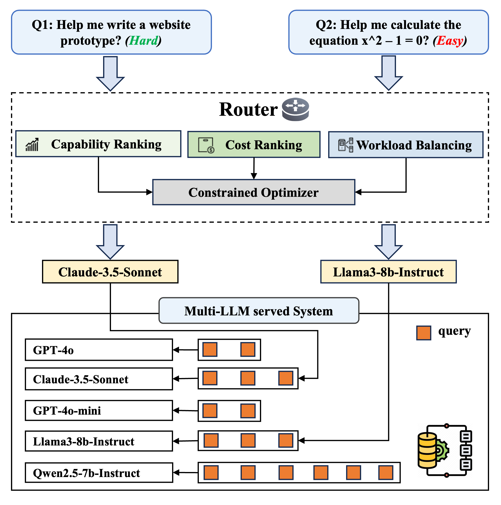

# ECCOS: Efficient Capability and Cost Coordinated Scheduling for Multi-LLM Serving
This is the official code implementation of paper [ECCOS: Efficient Capability and Cost Coordinated Scheduling for Multi-LLM Serving].

## 🏠 Overview of ECCOS
<p align="center">

</p>

## 🚀 Quickstart

### ⚙️ Installation
```
conda create -n eccos python=3.11
conda activate eccos
pip install -r requirements.txt
```


## 🌹Reference
If you find this project useful, please cite our paper