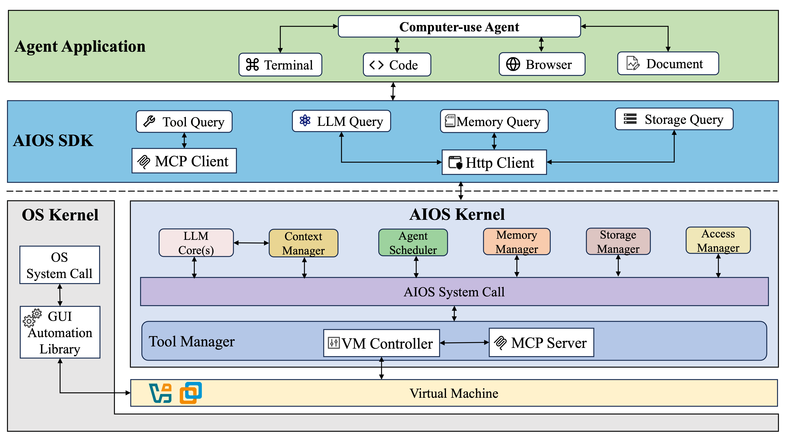

# AIOS: AI Agent Operating System

<a href='https://arxiv.org/abs/2403.16971'></a>
<a href='https://arxiv.org/abs/2312.03815'></a>
<a href='https://docs.aios.foundation/'></a>
<a href='https://discord.gg/B2HFxEgTJX'></a>
[](https://gurubase.io/g/aios)

<a href="https://trendshift.io/repositories/8908" target="_blank"></a>
<a href="https://give.rutgersfoundation.org/aios-project/23717.html" target="_blank"></a>

AIOS is the AI Agent Operating System, which embeds large language model (LLM) into the operating system and facilitates the development and deployment of LLM-based AI Agents. AIOS is designed to address problems (e.g., scheduling, context switch, memory management, storage management, tool management, Agent SDK management, etc.) during the development and deployment of LLM-based agents, towards a better AIOS-Agent ecosystem for agent developers and agent users. AIOS includes the AIOS Kernel (this [AIOS](https://github.com/agiresearch/AIOS) repository) and the AIOS SDK (the [Cerebrum](https://github.com/agiresearch/Cerebrum) repository). AIOS supports both Web UI and Terminal UI.

## 🏠 Architecture of AIOS
### Overview
<p align="center">

</p>

The AIOS system is comprised of two key components: the AIOS kernel and the AIOS SDK.
The AIOS kernel acts as an abstraction layer over the operating system kernel, managing various resources that agents require, such as LLM, memory, storage and tool. 
The AIOS SDK is designed for agent users and developers, enabling them to build and run agent applications by interacting with the AIOS kernel.
AIOS kernel is the current repository and AIOS SDK can be found at [here](https://github.com/agiresearch/Cerebrum)

### Modules and Connections
Below shows how agents utilize AIOS SDK to interact with AIOS kernel and how AIOS kernel receives agent queries and leverage the chain of syscalls that are scheduled and dispatched to run in different modules. 
<p align="center">

</p>

### Computer-use Specialized Architecture
For computer-use agent, the architecture extends the AIOS Kernel with significant enhancements focused on computer contextualization. While preserving essential components like LLM Core(s), Context Manager, and Memory Manager, the Tool Manager module has been fundamentally redesigned to incorporate a VM (Virtual Machine) Controller and MCP Server.
This redesign creates a sandboxed environment that allows agents to safely interact with computer systems while
maintaining a consistent semantic mapping between agent intentions and computer operations. 

<p align="center">

</p>

## 📰 News
- **[2025-07-08]** 🎉 The foundational paper [AIOS: LLM Agent Operating System](https://arxiv.org/abs/2403.16971) has been accepted by the Conference on Language Modeling (COLM 2025). Congratulations to the team!
- **[2025-07-02]** 🎉 AIOS has been selected as the finalist for AgentX – LLM Agents MOOC Competition, hosted by Berkeley RDI in conjunction with the Advanced LLM Agents MOOC. Congratulations to the team!
- **[2025-05-24]** 📋 Check out our paper on computer-use agent: [LiteCUA: Computer as MCP Server for Computer-Use Agent on AIOS](https://arxiv.org/pdf/2505.18829) and the corresponding [codebase](https://github.com/agiresearch/LiteCUA). 
- **[2025-03-13]** 📋 Paper [Cerebrum (AIOS SDK): A Platform for Agent Development, Deployment, Distribution, and Discovery](https://arxiv.org/abs/2503.11444) has been accepted by NAACL 2025! Features has been integrated into [Cerebrum](https://github.com/agiresearch/Cerebrum).
- **[2025-03-12]** 🔥 A major refactor of the codebase packed with powerful new features have been integrated into the main repo. Please check out the AIOS v0.2.2 release.
- **[2025-03-10]** 📋 Check out our paper on agentic memory [A-MEM: Agentic Memory for LLM Agents](https://arxiv.org/abs/2502.12110) and the corresponding [codebase](https://github.com/agiresearch/A-mem). 
- **[2025-02-07]** 📋 Our paper [From Commands to Prompts: LLM-based Semantic File System for AIOS](https://arxiv.org/abs/2410.11843) has been accepted by ICLR2025! The features of this paper has been integrated into AIOS as the **Terminal UI**. 
- **[2025-01-27]** 🔥 Deepseek-r1 (1.5b, 7b, 8b, 14b, 32b, 70b, 671b) has already been supported in AIOS, both open-sourced versions and deepseek apis (deepseek-chat and deepseek-reasoner) are available. 
- **[2024-11-30]** 🔥 AIOS v0.2: Disentangled AIOS Kernel (this [AIOS](https://github.com/agiresearch/AIOS) repository) and AIOS SDK (The [Cerebrum](https://github.com/agiresearch/Cerebrum) repository), Remote Kernel for agent users. 
- **[2024-09-01]** 🔥 AIOS supports multiple agent creation frameworks (e.g., ReAct, Reflexion, OpenAGI, AutoGen, Open Interpreter, MetaGPT). Agents created by these frameworks can onboard AIOS. Onboarding guidelines can be found at the [Doc](https://docs.aios.foundation/aios-docs/aios-agent/how-to-develop-agents).
- **[2024-07-10]** 📖 AIOS documentation is up, which can be found at [Website](https://docs.aios.foundation/).
- **[2024-06-20]** 🔥 Function calling for open-sourced LLMs (native huggingface, vLLM, ollama) is supported.
- **[2024-05-20]** 🚀 More agents with ChatGPT-based tool calling are added (i.e., MathAgent, RecAgent, TravelAgent, AcademicAgent and CreationAgent), their profiles and workflows can be found in [OpenAGI](https://github.com/agiresearch/OpenAGI).
- **[2024-05-13]** 🛠️ Local models (diffusion models) as tools from HuggingFace are integrated.
- **[2024-05-01]** 🛠️ The agent creation in AIOS is refactored, which can be found in our [OpenAGI](https://github.com/agiresearch/OpenAGI) package.
- **[2024-04-05]** 🛠️ AIOS currently supports external tool callings (google search, wolframalpha, rapid API, etc).
- **[2024-04-02]** 🤝 AIOS [Discord Community](https://discord.gg/B2HFxEgTJX) is up. Welcome to join the community for discussions, brainstorming, development, or just random chats! For how to contribute to AIOS, please see [CONTRIBUTE](https://github.com/agiresearch/AIOS/blob/main/docs/CONTRIBUTE.md).
- **[2024-03-25]** ✈️ Our paper [AIOS: LLM Agent Operating System](https://arxiv.org/abs/2403.16971) is released!
- **[2023-12-06]** 📋 After several months of working, our perspective paper [LLM as OS, Agents as Apps: Envisioning AIOS, Agents and the AIOS-Agent Ecosystem](https://arxiv.org/abs/2312.03815) is officially released.

## Different deployment modes of AIOS
Here are some key notations that are required to know before introducing the different modes of AIOS. 
- **AHM (Agent Hub Machine)**: Central server that hosts the agent marketplace/repository where users can publish, download, and share agents. Acts as the distribution center for all agent-related resources.
- **AUM (Agent UI Machine)**: Client machine that provides user interface for interacting with agents. Can be any device from mobile phones to desktops that supports agent visualization and control.
- **ADM (Agent Development Machine)**: Development environment where agent developers write, debug and test their agents. Requires proper development tools and libraries.
- **ARM (Agent Running Machine)**: Execution environment where agents actually run and perform tasks. Needs adequate computational resources for agent operations.

The following parts introduce different modes of deploying AIOS. **Currently, AIOS already supports Mode 1 and Mode 2, other modes with new features are still ongoing.**

### Mode 1 (Local Kernel Mode)

<p align="center">

</p>

- Features:
  - For agent users: They can download agents from agent hub from Machine B and run agents on Machine A. 
  - For agent developers: They can develop and test agents in Machine A and can upload agents to agent hub on Machine B.

### Mode 2 (Remote Kernel Mode)

<p align="center">

</p>

- Features: 
  - Remote use of agents: Agent users / developers can use agents on Machine B, which is different from the development and running machine (Machine A).  
  - Benefit users who would like to use agents on resource-restricted machine (e.g., mobile device or edge device)

### Mode 2.5 (Remote Kernel Dev Mode)

<p align="center">

</p>

- Features:
  - Remote development of agents: Agent developers can develop their agents on Machine B while running and testing their agents in Machine A. Benefit developers who would like to develop agents on resource-restricted machine (e.g., mobile device or edge device)
- Critical technique:
  - Packaging and agent transmission on different machines for distributed agent development and testing

### Mode 3 (Personal Remote Kernel Mode)

<p align="center">

</p>

- Ongoing Features:
  - Each user/developer can have their personal AIOS with long-term persistent data as long as they have registered account in the AIOS ecosystem
  - Their personal data can be synced to different machines with the same account

- Critical techniques:
  - User account registration and verification mechanism
  - Persistent personal data storage for each user's AIOS
  - Synchronization for different AIOS instances on different devices within the same account
  - Data privacy mechanism

### Mode 4 (Personal Remote Virtual Kernel Mode)

<p align="center">

</p>

- Ongoing Features:
  - Different user/developer's personal AIOS kernels can co-exist in the same physical machine through virtualization
- Critical techniques:
  - Virtualization of different AIOS kernel instances in the same machine
  - Scheduling and resource allocation mechanism for different virtual machines located in the same machine


## ✈️ Getting Started
Please see our ongoing [documentation](https://docs.aios.foundation/) for more information.
- [Installation](https://docs.aios.foundation/aios-docs/getting-started/installation)
- [Quickstart](https://docs.aios.foundation/aios-docs/getting-started/quickstart)
- [WebUI Quickstart](https://docs.aios.foundation/aios-docs/getting-started/webui-quickstart)

### Installation
#### Requirements
##### Python
- Supported versions: **Python 3.10 - 3.11**

#### Installation from source

##### Step 1: Install AIOS Kernel
Git clone AIOS kernel
```bash
git clone https://github.com/agiresearch/AIOS.git
```
Create venv environment
```bash
python3.x -m venv venv # Only support for Python 3.10 and 3.11
source venv/bin/activate
```
or create conda environment
```bash
conda create -n venv python=3.x  # Only support for Python 3.10 and 3.11
conda activate venv
```

> [!TIP]
> We strongly recommend using [uv](https://github.com/astral-sh/uv) for faster and more reliable package installation.
> To install uv: 
> ```bash pip install uv```

**For GPU environments:**
```bash
uv pip install -r requirements-cuda.txt
```

**For CPU-only environments:**
```bash
uv pip install -r requirements.txt
```

Alternatively, if you prefer using pip:

**For GPU environments:**
```bash
pip install -r requirements-cuda.txt
```

**For CPU-only environments:**
```bash
pip install -r requirements.txt
```

##### Step 2: Install AIOS SDK (Cerebrum)
1. Clone the Cerebrum repository:
   ```bash
   git clone https://github.com/agiresearch/Cerebrum.git
   ```
  
2. Install using uv (recommended):
   ```bash
   cd Cerebrum && uv pip install -e .
   ```
   
   Or using pip:
   ```bash
   cd Cerebrum && pip install -e .
   ```

##### Step 3: Install Virtualized Environment (Optional)
To use the mcp for computer-use agent, we strongly recommend you install a virtualized environment equipped with GUI. Instructions can be found in [here](https://github.com/xlang-ai/OSWorld). 

**Note**: The machine where the AIOS kernel (AIOS) is installed must also have the AIOS SDK (Cerebrum) installed. Installing AIOS kernel will install the AIOS SDK automatically by default. If you are using the Local Kernel mode, i.e., you are running AIOS and agents on the same machine, then simply install both AIOS and Cerebrum on that machine. If you are using Remote Kernel mode, i.e., running AIOS on Machine 1 and running agents on Machine 2 and the agents remotely interact with the kernel, then you need to install both AIOS kernel and AIOS SDK on Machine 1, and install the AIOS SDK alone on Machine 2. Please follow the guidelines at [Cerebrum](https://github.com/agiresearch/Cerebrum) regarding how to install the SDK.

### Quickstart
Before launching AIOS, it is required to set up configurations. AIOS provides two ways of setting up configurations, one is to set up by directly modifying the configuration file, another is to set up interactively. 

#### Set up configuration file directly (Recommended)
You need API keys for services like OpenAI, Anthropic, Groq and HuggingFace. The simplest way to configure them is to edit the `aios/config/config.yaml`.

> [!TIP]
> It is important to mention that, we strongly recommend using the `aios/config/config.yaml` file to set up your API keys. This method is straightforward and helps avoid potential sychronization issues with environment variables. 

A simple example to set up your API keys in `aios/config/config.yaml` is shown below:
```yaml
api_keys:
  openai: "your-openai-key"    
  gemini: "your-gemini-key"    
  groq: "your-groq-key"      
  anthropic: "your-anthropic-key" 
  huggingface:
    auth_token: "your-huggingface-token-for-authorized-models"  
    cache_dir: "your-cache-dir-for-saving-models"
  novita: "your-novita-api-key"
```

To obtain these API keys:
1. Deepseek API: Visit https://api-docs.deepseek.com/
2. OpenAI API: Visit https://platform.openai.com/api-keys
3. Google Gemini API: Visit https://makersuite.google.com/app/apikey
4. Groq API: Visit https://console.groq.com/keys
5. HuggingFace Token: Visit https://huggingface.co/settings/tokens
6. Anthropic API: Visit https://console.anthropic.com/keys
7. Novita AI API: Visit https://novita.ai/api-keys

#### Configure LLM Models
You can configure which LLM models to use in the same `aios/config/config.yaml` file. Here's an example configuration:

```yaml
llms:
  models:
    # Ollama Models
    - name: "qwen2.5:7b"
      backend: "ollama"
      hostname: "http://localhost:11434"  # Make sure to run ollama server

    # vLLM Models
    - name: "meta-llama/Llama-3.1-8B-Instruct"
      backend: "vllm"
      hostname: "http://localhost:8091/v1"  # Make sure to run vllm server
```

**Using Ollama Models:** 
1. First, download ollama from https://ollama.com/
2. Start the ollama server in a separate terminal:
```bash
ollama serve
```
3. Pull your desired models from https://ollama.com/library:
```bash
ollama pull qwen2.5:7b  # example model
```

> [!TIP]
> Ollama supports both CPU-only and GPU environments. For more details about ollama usage, visit [ollama documentation](https://github.com/ollama/ollama)

**Using vLLM Models:**
1. Install vLLM following their [installation guide](https://docs.vllm.ai/en/latest/getting_started/installation.html)
2. Start the vLLM server in a separate terminal:
```bash
vllm serve meta-llama/Llama-3.1-8B-Instruct --port 8091
```

> [!NOTE]
> vLLM currently only supports Linux and GPU-enabled environments. If you don't have a compatible environment, please choose other backend options.
> To enable the tool calling feature of vllm, refer to https://docs.vllm.ai/en/latest/features/tool_calling.html

**Using HuggingFace Models:** 
You can configure HuggingFace models with specific GPU memory allocation:
```yaml
- name: "meta-llama/Llama-3.1-8B-Instruct"
  backend: "huggingface"
  max_gpu_memory: {0: "24GB", 1: "24GB"}  # GPU memory allocation
  eval_device: "cuda:0"  # Device for model evaluation
```

#### Set up interactively

Alternatively, you can set up aios configurations interactively by using the following command. 

- `aios env list`: Show current environment variables, or show available API keys if no variables are set
- `aios env set`: Show current environment variables, or show available API keys if no variables are set
- `aios refresh`: Refresh AIOS configuration.
  Reloads the configuration from aios/config/config.yaml.
  Reinitializes all components without restarting the server.
  The server must be running.

When no environment variables are set, the following API keys will be shown:
- `DEEPSEEK_API_KEY`: Deepseek API key for accessing Deepseek services
- `OPENAI_API_KEY`: OpenAI API key for accessing OpenAI services
- `GEMINI_API_KEY`: Google Gemini API key for accessing Google's Gemini services
- `GROQ_API_KEY`: Groq API key for accessing Groq services
- `HF_AUTH_TOKEN`: HuggingFace authentication token for accessing models
- `HF_HOME`: Optional path to store HuggingFace models
- `NOVITA_API_KEY`: Novita AI API key for accessing Novita AI services

#### Launch AIOS
After you setup your keys or environment parameters, then you can follow the instructions below to start.

Run:

```
bash runtime/launch_kernel.sh
```

Or if you need to explicity set the Python version by running `python3.10`, `python3.11`, `python3`, etc. run the command below:

```
python3.x -m uvicorn runtime.launch:app --host 0.0.0.0 --port 8000 # replace the port with your own port
```

You also need to set up the host and port in the configuration of Cerebrum (AIOS SDK) to make sure it is consistent with the configurations of AIOS. 

You can also force the kernel to run in the background with:
```
python3.x -m uvicorn runtime.launch:app --host 0.0.0.0 > uvicorn.log 2>&1 &
```

And you can run it even after the shell closes by typing `nohup` before the entire command.

Command to launch the kernel in the background so it continues running even after the active shell is closed, while also logging information to the specified log file (recommended):

```
nohup python3 -m uvicorn runtime.launch:app --host 0.0.0.0 --port 8000 > uvicorn.log 2>&1 &
```

#### Interact with AIOS terminal

To interact with the AIOS terminal (LLM-based semantic file system), you can run the following command to start the AIOS terminal.

```
python scripts/run_terminal.py
```

Then you can start interacting with the AIOS terminal by typing natural language commands. 

If you successfully start the AIOS terminal, it will be shown as below: 

<p align="center">

</p>

Detailed instructions of how to use the AIOS terminal can be found at [here](https://github.com/agiresearch/AIOS-LSFS)

> [!WARNING]
> The rollback feature of the AIOS terminal requires the connection to the redis server. Make sure you have the redis server running if you would like to use the rollback feature.

#### Run computer-use Agent
Make sure you have installed a virtualized environment with GUI, then you can refer to [Cerebrum](https://github.com/agiresearch/Cerebrum) for how to run the computer-use agent. 

### Supported Agent Frameworks
- [OpenAGI](https://github.com/agiresearch/openagi)
- [AutoGen](https://github.com/microsoft/autogen)
- [Open-Interpreter](https://github.com/OpenInterpreter/open-interpreter)
- [MetaGPT](https://github.com/geekan/MetaGPT?tab=readme-ov-file)

### Supported LLM Cores
| Provider 🏢 | Model Name 🤖 | Open Source 🔓 | Model String ⌨️ | Backend ⚙️ | Required API Key |
|:------------|:-------------|:---------------|:---------------|:---------------|:----------------|
| Anthropic | [All Models](https://makersuite.google.com/app/apikey) | ❌ | model-name | anthropic | ANTHROPIC_API_KEY |
| OpenAI | [All Models](https://platform.openai.com/docs/models) | ✅ | model-name | openai | OPENAI_API_KEY |
| Deepseek | [All Models](https://api-docs.deepseek.com/) | ✅ | model-name | deepseek | DEEPSEEK_API_KEY |
| Google | [All Models](https://makersuite.google.com/app/apikey) | ❌ | model-name | gemini| GEMINI_API_KEY |
| Groq | [All Models](https://console.groq.com/keys) | ✅ | model-name | groq | GROQ_API_KEY |
| HuggingFace | [All Models](https://huggingface.co/models/) | ✅ | model-name |huggingface| HF_HOME |
| ollama | [All Models](https://ollama.com/search) | ✅ | model-name | ollama | - |
| vLLM | [All Models](https://docs.vllm.ai/en/latest/) | ✅ | model-name | vllm | - |
| Novita | [All Models](https://novita.ai/models/llm) | ✅ | model-name | novita | NOVITA_API_KEY |

## 🔧 Experimental Rust Rewrite (aios-rs)
An early experimental Rust scaffold lives in `aios-rs/` providing trait definitions and minimal placeholder implementations (context, memory, storage, tool, scheduler, llm). This is NOT feature-parity yet; it's a foundation for incremental porting and performance-focused components.

### Try It
```bash
cd aios-rs
cargo build
cargo test
```

### Example (Echo LLM + Noop Scheduler)
```rust
use aios_rs::prelude::*;

fn main() -> anyhow::Result<()> {
  let llm = std::sync::Arc::new(EchoLLM);
  let memory = std::sync::Arc::new(std::sync::Mutex::new(InMemoryMemoryManager::new()));
  let storage = std::sync::Arc::new(FsStorageManager::new("/tmp/aios_store"));
  let tool = std::sync::Arc::new(NoopToolManager);
  let mut scheduler = NoopScheduler::new(llm, memory, storage, tool);
  scheduler.start()?;
  scheduler.stop()?;
  Ok(())
}
```

### Roadmap Snapshot
```
- [x] Core trait scaffolding
- [ ] Async runtime + channels
- [ ] Vector store abstraction
- [ ] Python bridge (pyo3 / IPC)
- [ ] Port FIFO / RR schedulers
- [ ] Benchmarks & feature flags

Contributions welcome via focused PRs extending this scaffold. See `aios-rs/README.md` for details.
```

## Reference
```
@article{mei2025aios,
  title={AIOS: LLM Agent Operating System},
  author={Mei, Kai and Zhu, Xi and Xu, Wujiang and Hua, Wenyue and Jin, Mingyu and Li, Zelong and Xu, Shuyuan and Ye, Ruosong and Ge, Yingqiang and Zhang, Yongfeng}
  journal={In Proceedings of the 2nd Conference on Language Modeling (COLM 2025)},
  year={2025}
}
@article{mei2025litecua,
  title={LiteCUA: Computer as MCP Server for Computer-Use Agent on AIOS},
  author={Mei, Kai and Zhu, Xi and Gao, Hang and Lin, Shuhang and Zhang, Yongfeng},
  journal={arXiv preprint arXiv:2505.18829},
  year={2025}
}
@article{xu2025mem,
  title={A-Mem: Agentic Memory for LLM Agents},
  author={Xu, Wujiang and Liang, Zujie and Mei, Kai and Gao, Hang and Tan, Juntao and Zhang, Yongfeng},
  journal={arXiv:2502.12110},
  year={2025}
}
@inproceedings{rama2025cerebrum,
  title={Cerebrum (AIOS SDK): A Platform for Agent Development, Deployment, Distribution, and Discovery}, 
  author={Balaji Rama and Kai Mei and Yongfeng Zhang},
  booktitle={2025 Annual Conference of the Nations of the Americas Chapter of the Association for Computational Linguistics},
  year={2025}
}
@inproceedings{shi2025from,
  title={From Commands to Prompts: {LLM}-based Semantic File System for AIOS},
  author={Zeru Shi and Kai Mei and Mingyu Jin and Yongye Su and Chaoji Zuo and Wenyue Hua and Wujiang Xu and Yujie Ren and Zirui Liu and Mengnan Du and Dong Deng and Yongfeng Zhang},
  booktitle={The Thirteenth International Conference on Learning Representations},
  year={2025},
  url={https://openreview.net/forum?id=2G021ZqUEZ}
}
@article{ge2023llm,
  title={LLM as OS, Agents as Apps: Envisioning AIOS, Agents and the AIOS-Agent Ecosystem},
  author={Ge, Yingqiang and Ren, Yujie and Hua, Wenyue and Xu, Shuyuan and Tan, Juntao and Zhang, Yongfeng},
  journal={arXiv:2312.03815},
  year={2023}
}
```

## 🚀 Contributions
For how to contribute, see [CONTRIBUTE](https://github.com/agiresearch/AIOS/blob/main/docs/CONTRIBUTE.md). If you would like to contribute to the codebase, [issues](https://github.com/agiresearch/AIOS/issues) or [pull requests](https://github.com/agiresearch/AIOS/pulls) are always welcome!

## 🌍 AIOS Contributors
[](https://github.com/agiresearch/AIOS/graphs/contributors)

## Acknowledgement
We learned the design and reused code from the following projects: [LiteLLM](https://docs.litellm.ai/docs/), [OSWorld](https://os-world.github.io/).

## 🤝 Discord Channel
If you would like to join the community, ask questions, chat with fellows, learn about or propose new features, and participate in future developments, join our [Discord Community](https://discord.gg/B2HFxEgTJX)!
